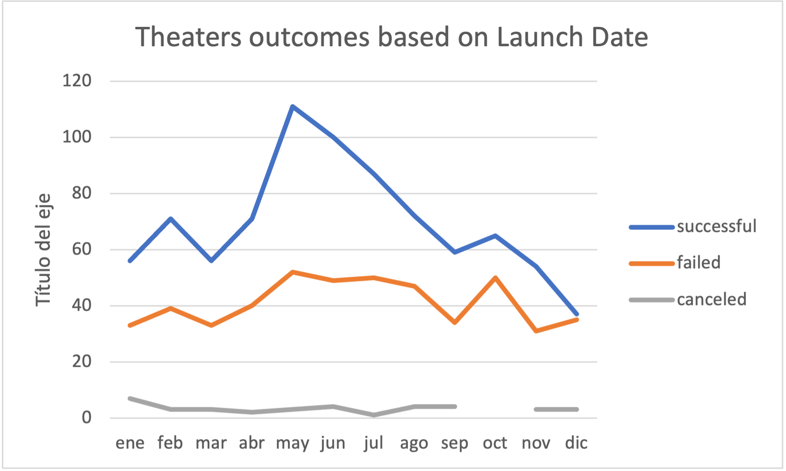
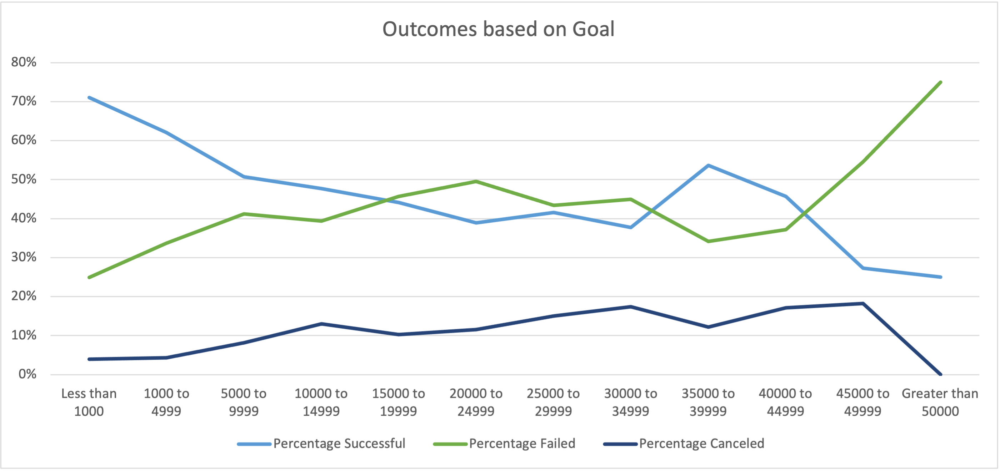

# An analysis of Kickstarter Campaigns
Challenge 1 Kickstarter analysis: Perform a data analysis to Kickstarter to uncover trends
## Overview of Project

### Purpose
The purpose of this analysis is to help the client Louise to know how different campaigns fared in relation to their launch dates and their funding goals

## Analysis and Challenges

### Analysis of Outcomes Based on Launch Date
- The month that had the most outcomes based on Launch Date was May. However, May, June and July had roughly the same number of successful outocomes. So we can imply that the best season to Launch any play is the second quarter of the year. This can be determined by examining the points along the trend lines of the chart.

- The month with the worst outcomes based on Launch Date was October, beside having the roughly the same number of failed outcomes than May (the month with the best outcomes), the percentage of successful plays was very different.
 
- We can conclude that after the best launching season (second quarter of the year), theres a peak in failed plays, people prefer going to the theater on final spring and summer, rather than the final part of the year

### Analysis of Outcomes Based on Goals
- Outcomes based on plays are really simple, the best outcomes were the ones with the lower goals (less than $1000), however theres a range where the percentage failed is lower than the majority of the goal outcomes and not being the lower one: $35,000-$40,000, wich is a better goal, considering the outcomes of the different ranges

### Challenges and Difficulties Encountered

## Results

- What are two conclusions you can draw about the Outcomes based on Launch Date?

- What can you conclude about the Outcomes based on Goals?

- What are some limitations of this dataset?

- What are some other possible tables and/or graphs that we could create?
